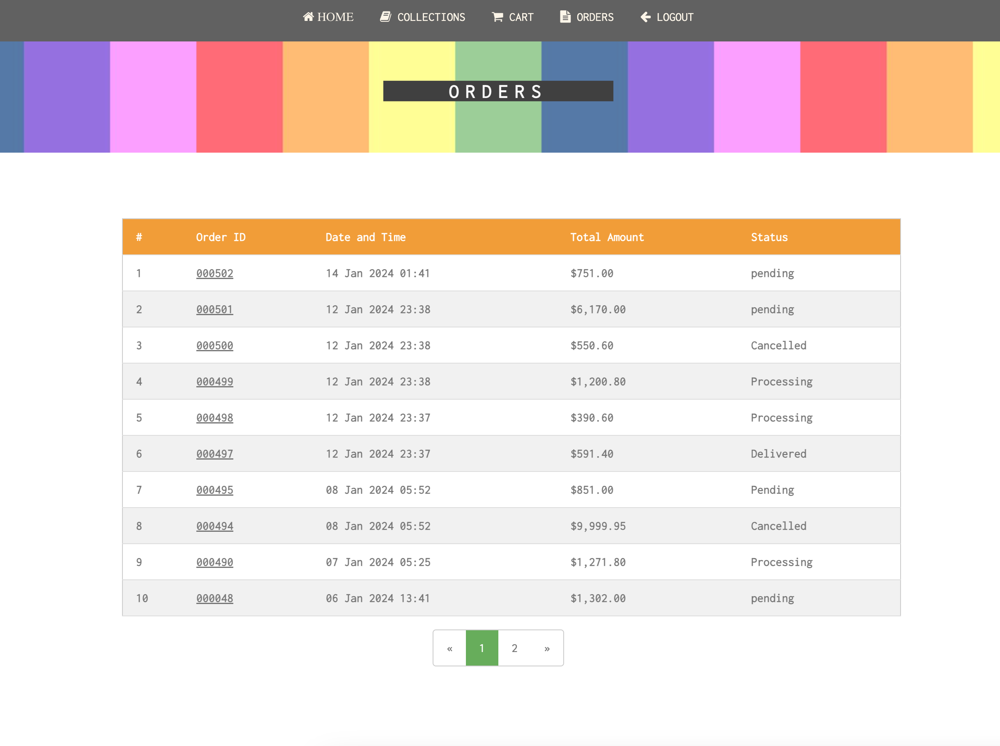
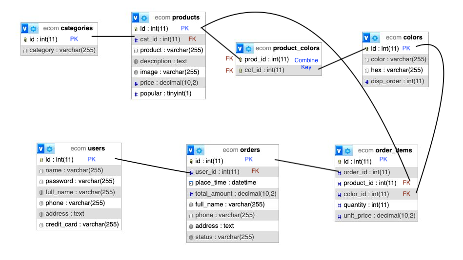

# CCC - PHPDB Final Project

Create Career College - PHP and Database Final Project by Henry Wat and Jason Lin

---

## Tutor: Parveen
## Submission Date: 13 Jan 2024

### Technologies:
- PHP
- SQL

---

## Nippon Paint eShop
### Henry Wat: Database design and business model programming
### Jason Lin: UI and UX design and presentation layer programming

---

### Bugs Fix:
- 13 Jan 2024: "Name" value of orders page is replace by "orders" table field "full_name" instead of "users" table.

---

## Screen Shots:

### [Collections](collections.png)

### [Orders](orders.png)

### [Order Detail](orderdetail.png)

### [Admin Update Product](updateproduct.png)

### [Update Order Status](updateorderstatus.png)

### [ER Diagranm](ERD.png)

